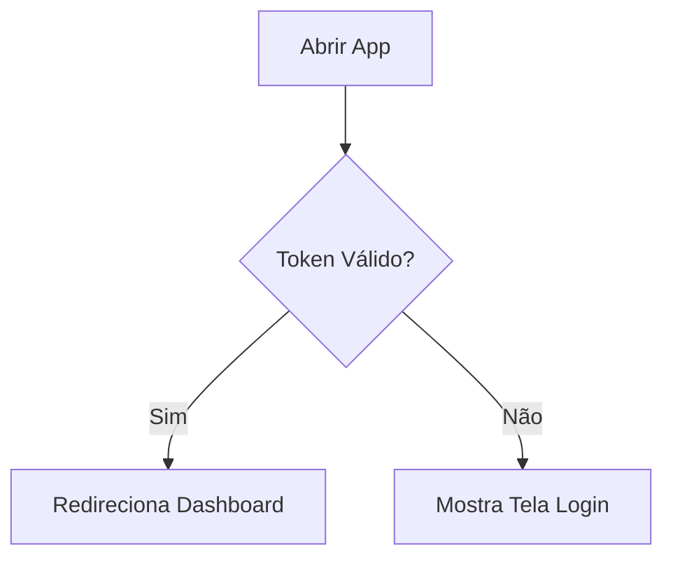
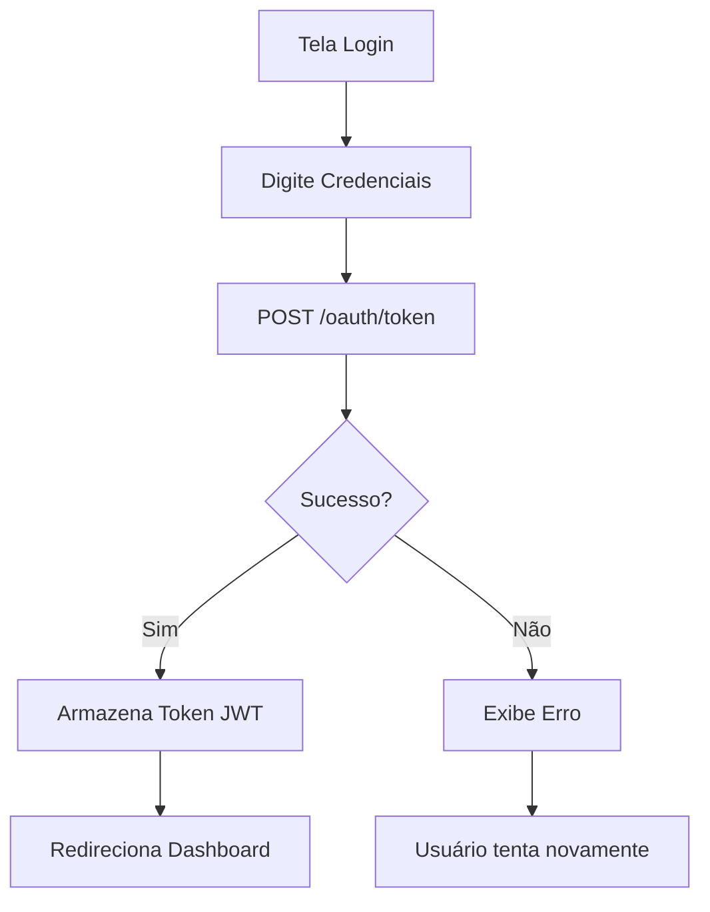
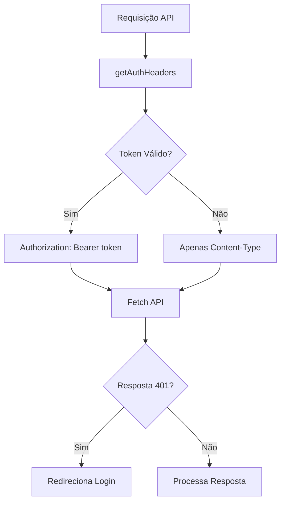
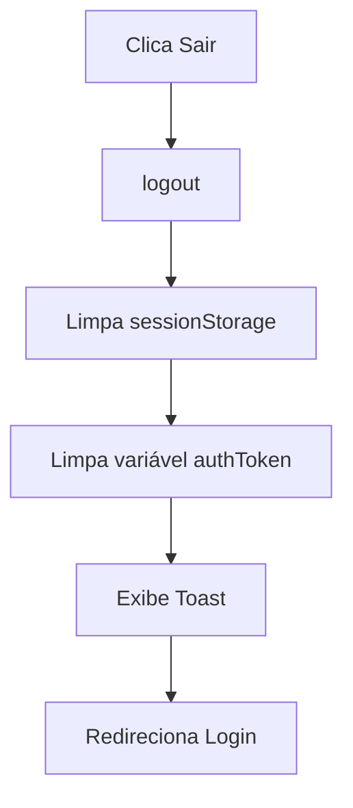
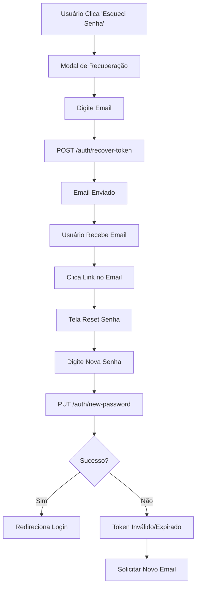

# Integração de Autenticação OAuth2

## Visão Geral

O sistema de controle financeiro familiar usa autenticação integrada com Spring Boot OAuth2, com as seguintes configurações do `application.properties`:

```properties
security.client-id=${CLIENT_ID:myclientid}
security.client-secret=${CLIENT_SECRET:myclientsecret}
security.jwt.duration=${JWT_DURATION:86400}
```

## Arquitetura

### 1. Serviço de Autenticação (`auth-service.ts`)

O serviço de autenticação gerencia:
- **Login OAuth2**: Usando Password Grant Type com client credentials
- **Token JWT**: Armazenamento e gerenciamento do token de acesso
- **Expiração**: Verificação automática de expiração do token
- **SessionStorage**: Tokens armazenados em sessionStorage (limpam ao fechar o navegador)

#### Funções Principais:

**Autenticação:**
```typescript
// Fazer login com OAuth2
login(credentials: LoginCredentials): Promise<boolean>

// Fazer logout e limpar tokens
logout(): void

// Obter token de autenticação
getAuthToken(): string | null

// Verificar se está autenticado
isAuthenticated(): boolean

// Obter headers com autorização
getAuthHeaders(): HeadersInit
```

**Autorização (RBAC):**
```typescript
// Obter roles/authorities do usuário atual
getUserAuthorities(): string[]

// Verificar se tem uma role específica
hasRole(role: string): boolean

// Verificar se é administrador (ROLE_ADMIN)
isAdmin(): boolean

// Obter username do usuário atual
getCurrentUsername(): string | null
```

**📖 Documentação Completa**: Veja [ACCESS_CONTROL.md](./ACCESS_CONTROL.md) para detalhes sobre controle de acesso.

### 2. Tela de Login (`LoginScreen.tsx`)

A tela de login possui:
- **Campos**: Nome de usuário e senha
- **Validação**: Verifica se todos os campos estão preenchidos
- **Feedback Visual**: Estados de loading e mensagens de erro
- **Enter para Submeter**: Pressionar Enter faz login
- **Integração API**: Conecta diretamente com o endpoint OAuth2

### 3. API Helpers (`api-helpers.ts`)

Camada de abstração que:
- **Converte tipos**: Da API para tipos da aplicação
- **Simplifica chamadas**: Funções helper para todas as operações
- **Gerencia categorias**: Busca IDs de categorias automaticamente

#### Funções Disponíveis:

```typescript
// Transações
getTransactions(): Promise<Transaction[]>
saveTransaction(transaction): Promise<Transaction>
updateTransaction(id, transaction): Promise<Transaction>
deleteTransaction(id): Promise<void>

// Membros
getMembers(): Promise<Member[]>
saveMember(member): Promise<Member>
updateMember(id, member): Promise<Member>
deleteMember(id): Promise<void>

// Categorias
getCategories(): Promise<Category[]>
```

### 4. Integração com API (`api-service.ts`)

Todas as requisições HTTP incluem:
- **Header Authorization**: `Bearer {token}` automaticamente
- **Headers Padronizados**: Via `getAuthHeaders()`
- **Tratamento de Erros**: Respostas HTTP são tratadas adequadamente

#### Endpoints Protegidos:

```typescript
// Categorias
categoriesApi.getAll()
categoriesApi.create(name)
categoriesApi.update(id, name)
categoriesApi.delete(id)

// Membros
membersApi.getAll()
membersApi.create(name, role)
membersApi.update(id, name, role)
membersApi.delete(id)

// Transações
transactionsApi.getAll()
transactionsApi.getById(id)
transactionsApi.create(transaction)
transactionsApi.update(id, transaction)
transactionsApi.delete(id)
```

### 5. Dashboard com Logout

O Dashboard possui:
- **Botão Sair**: Limpa tokens e redireciona para login
- **Toast de Notificação**: Confirma logout
- **Gerenciamento de Estado**: Via props onLogout

## Fluxo de Autenticação

### 1. Inicialização do App



### 2. Login



### 3. Requisições Autenticadas



### 4. Logout



## Configuração do Backend

### Spring Boot - application.properties

```properties
# OAuth2 Client Credentials
security.client-id=${CLIENT_ID:myclientid}
security.client-secret=${CLIENT_SECRET:myclientsecret}

# JWT Token Duration (86400 = 24 horas)
security.jwt.duration=${JWT_DURATION:86400}
```

### Endpoint de Token

```
POST http://localhost:8080/oauth2/token
Content-Type: application/x-www-form-urlencoded
Authorization: Basic base64(client_id:client_secret)

grant_type=password
username={username}
password={password}
```

**IMPORTANTE:** O `client_id` e `client_secret` vão APENAS no header `Authorization: Basic`, não no body!

### Resposta do Token

```json
{
  "access_token": "eyJhbGciOiJIUzI1NiIsInR5cCI6IkpXVCJ9...",
  "token_type": "Bearer",
  "expires_in": 86400,
  "refresh_token": "optional_refresh_token"
}
```

## Armazenamento

### SessionStorage Keys

- `auth_token`: Token JWT de acesso
- `auth_expires_at`: Timestamp de expiração do token
- `refresh_token`: Token de refresh (opcional)

**Por que sessionStorage?**
- Maior segurança: tokens são limpos ao fechar o navegador
- Previne ataques XSS de longa duração
- Força re-autenticação em novas sessões

## Segurança

### Boas Práticas Implementadas

✅ **Token JWT**: Autenticação stateless  
✅ **SessionStorage**: Tokens limpos ao fechar navegador  
✅ **HTTPS Recomendado**: Para produção  
✅ **Expiração de Token**: Verificação automática  
✅ **Client Credentials**: OAuth2 padrão  
✅ **Headers Seguros**: Authorization Bearer  
✅ **Sem LocalStorage de Senhas**: Credenciais não são armazenadas localmente

### Considerações de Segurança

⚠️ **HTTPS Obrigatório**: Use sempre HTTPS em produção  
⚠️ **Refresh Token**: Implementar para renovação automática  
⚠️ **Rate Limiting**: Implementar no backend para prevenir brute force  
⚠️ **CORS**: Configurar adequadamente no Spring Boot  
⚠️ **CSP**: Implementar Content Security Policy

## Recuperação de Senha

### Visão Geral

O sistema possui fluxo completo de recuperação de senha via email.

⚠️ **CRÍTICO - Configuração do Link:**

O backend **DEVE** gerar o link apontando para o **FRONTEND** (porta 5173), NÃO para si mesmo (porta 8080)!

```java
// Configuração no application.properties
frontend.url=http://localhost:5173  // Desenvolvimento
// frontend.url=https://seu-dominio.com  // Produção

// Código que gera o link
String link = frontendUrl + "/recover-password/" + token;
// Resultado: http://localhost:5173/recover-password/{token}
```

⚠️ **IMPORTANTE:** A validação do token (validade, expiração, uso único) é **responsabilidade exclusiva do backend**. O frontend apenas:
1. Extrai o token da URL
2. Envia para o backend no body da requisição
3. Exibe a resposta (sucesso ou erro)

### Endpoints da API

#### 1. Solicitar Recuperação

```
POST /auth/recover-token
Content-Type: application/json

{
  "to": "usuario@example.com",
  "subject": "Recuperação de Senha",
  "body": "Recuperação de Senha você tem 30 minutos para utilizar o token contido nesse email:"
}
```

**Resposta:**
```json
{
  "message": "Email de recuperação enviado"
}
```

**Observação:** O campo `to` recebe o email do usuário. Os campos `subject` e `body` são enviados com valores padrão.

#### 2. Resetar Senha

```
PUT /auth/new-password
Content-Type: application/json

{
  "token": "4813524e-ec0e-437a-8b41-e4476f77d684",
  "newPassword": "novaSenha123"
}
```

**Resposta de Sucesso:**
```json
{
  "message": "Senha alterada com sucesso"
}
```

**Resposta de Erro (Token Inválido):**
```json
{
  "status": 400,
  "error": "Bad Request",
  "message": "Token inválido ou expirado"
}
```

**Validações obrigatórias no backend:**
- ✅ Token existe no banco de dados
- ✅ Token não expirou (configurado: 30 minutos)
- ✅ Token não foi usado anteriormente
- ✅ Token pertence a um usuário válido

**Tempo de expiração:** 30 minutos (conforme especificado no corpo do email)

### Fluxo de Recuperação



### Componentes

#### 1. `ForgotPasswordDialog.tsx`

Modal para solicitar recuperação de senha:
- Campo de email com validação
- Integração com `/auth/recover-token`
- Tela de sucesso com instruções
- Feedback de loading

**Uso:**
```typescript
import { ForgotPasswordDialog } from './components/ForgotPasswordDialog';

<ForgotPasswordDialog
  open={showForgotPassword}
  onOpenChange={setShowForgotPassword}
/>
```

#### 2. `ResetPasswordScreen.tsx`

Tela completa para resetar senha com token:
- Campo de nova senha com visualização
- Confirmação de senha
- Validação de força da senha
- Integração com `/auth/new-password`
- Redirecionamento automático após sucesso

**Uso:**
```typescript
import { ResetPasswordScreen } from './components/ResetPasswordScreen';

<ResetPasswordScreen
  token="4813524e-ec0e-437a-8b41-e4476f77d684"
  onSuccess={() => navigate('/login')}
  onCancel={() => navigate('/login')}
/>
```

### Roteamento

O App gerencia automaticamente a rota de reset:

```
URL: http://localhost:8080/recover-password/{token}
```

Quando o usuário acessa esta URL:
1. Token é extraído da URL
2. Tela de reset é exibida automaticamente
3. Após sucesso, redireciona para login

### Link do Email

O backend deve enviar email com link no formato:

```
http://localhost:8080/recover-password/4813524e-ec0e-437a-8b41-e4476f77d684
```

### Validações

**Email:**
- ✅ Não vazio
- ✅ Formato válido (regex)

**Nova Senha:**
- ✅ Não vazia
- ✅ Mínimo 6 caracteres
- ✅ Confirmação deve coincidir

### Segurança

- ✅ Token único por requisição
- ✅ Token deve ter expiração (24-48h recomendado)
- ✅ Token de uso único (invalidar após uso)
- ✅ Email real do usuário validado no backend
- ✅ Senha não é enviada no email, apenas link

### Erros Comuns

**"Email não encontrado"**
- Email não está cadastrado no sistema
- Verifique ortografia do email

**"Token inválido ou expirado"**
- Link muito antigo (expirou)
- Token já foi usado
- Solicite novo email de recuperação

**"rawPassword cannot be null"**
- Campo senha vazio
- Validação do frontend previne isso

## Melhorias Futuras

1. **Refresh Token**: Renovação automática do token antes da expiração
2. ✅ **Recuperação de Senha**: Fluxo de reset via email - **IMPLEMENTADO**
3. **2FA**: Autenticação de dois fatores
4. **Biometria**: Login por impressão digital/Face ID (mobile)
5. **Session Timeout**: Logout automático por inatividade
6. **OAuth2 Social**: Login com Google, Facebook, etc.
7. **Remember Me**: Opção de manter login por mais tempo
8. **Audit Log**: Registro de todas as autenticações

## Testes

### Testar Login

1. Inicie o backend Spring Boot em `http://localhost:8080`
2. Acesse o aplicativo
3. Digite usuário e senha configurados no backend
4. Verifique se o token JWT é armazenado no sessionStorage
5. Navegue pelo aplicativo (todas as requisições devem incluir o token)

### Testar Expiração

1. Faça login normalmente
2. Aguarde o token expirar (ou force manualmente no sessionStorage)
3. Tente fazer uma operação
4. Sistema deve detectar token expirado e solicitar novo login

### Testar Logout

1. Faça login
2. Clique no botão "Sair"
3. Verifique se o sessionStorage foi limpo
4. Verifique se foi redirecionado para a tela de login
5. Toast de confirmação deve aparecer

## Troubleshooting

### Problema: "Credenciais inválidas"
**Solução:**
- Verifique se o backend está rodando em `http://localhost:8080`
- Confirme as credenciais client_id/client_secret no backend
- Verifique os logs do console do navegador
- Teste o endpoint OAuth2 manualmente com Postman/curl

### Problema: Token expira rapidamente
**Solução:**
- Ajuste `security.jwt.duration` no application.properties
- Implemente refresh token para renovação automática
- Valor padrão de 86400 = 24 horas

### Problema: CORS errors
**Solução:**
- Configure CORS no Spring Boot
- Adicione `http://localhost:5173` (Vite) nas origens permitidas
- Exemplo de configuração Spring Boot:
```java
@Configuration
public class CorsConfig implements WebMvcConfigurer {
    @Override
    public void addCorsMappings(CorsRegistry registry) {
        registry.addMapping("/**")
                .allowedOrigins("http://localhost:5173")
                .allowedMethods("GET", "POST", "PUT", "DELETE", "OPTIONS")
                .allowedHeaders("*")
                .allowCredentials(true);
    }
}
```

### Problema: "Erro ao conectar com o servidor"
**Solução:**
- Confirme que o backend está rodando
- Verifique o endpoint `/oauth/token` no backend
- Verifique firewall/antivírus bloqueando conexões
- Teste conexão com: `curl http://localhost:8080`

### Problema: Logout não funciona
**Solução:**
- Abra DevTools > Application > Session Storage
- Verifique se os tokens foram removidos
- Limpe manualmente se necessário
- Reinicie o navegador

## Exemplo de Uso

```typescript
import { login, logout, isAuthenticated, getAuthToken } from './auth-service';

// Login
const success = await login({
  username: 'usuario',
  password: 'senha123'
});

if (success) {
  console.log('Login realizado com sucesso!');
  console.log('Token:', getAuthToken());
}

// Verificar autenticação
if (isAuthenticated()) {
  console.log('Usuário está autenticado');
}

// Logout
logout();
console.log('Usuário desconectado');
```

## Compatibilidade

- ✅ Chrome/Edge 90+
- ✅ Firefox 88+
- ✅ Safari 14+
- ✅ Mobile (iOS/Android)
- ✅ Desktop (Windows/Mac/Linux)

## Estrutura de Arquivos

```
/components
  ├── auth-service.ts       # Serviço de autenticação OAuth2
  ├── api-service.ts        # Chamadas HTTP para a API
  ├── api-helpers.ts        # Conversão de tipos e helpers
  ├── LoginScreen.tsx       # Tela de login
  └── Dashboard.tsx         # Dashboard com logout
```

## Diferenças vs Versão Anterior

### ❌ Removido
- `data-service.ts` - Não há mais armazenamento local
- Modo offline/online - Sistema funciona apenas online
- localStorage de credenciais - Não armazena senhas localmente
- Configuração inicial - Não há tela de "primeira vez"

### ✅ Adicionado
- `api-helpers.ts` - Camada de abstração para a API
- sessionStorage - Armazenamento mais seguro de tokens
- Feedback de erro melhorado - Mensagens mais claras
- Fluxo simplificado - Apenas login online

## Requisitos

### Backend Spring Boot
- Spring Boot 2.x ou 3.x
- Spring Security com OAuth2
- Endpoints REST para categories, members, transactions
- CORS configurado para origem do frontend

### Frontend
- React 18+
- Vite
- API rodando em `http://localhost:8080`

## Conclusão

O sistema agora funciona exclusivamente com a API Spring Boot, sem fallback para armazenamento local. Isso garante:
- ✅ Dados sempre sincronizados
- ✅ Segurança aprimorada
- ✅ Arquitetura simplificada
- ✅ Manutenção facilitada
- ✅ Escalabilidade garantida
