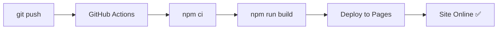

# Changelog - Controle Financeiro Familiar

## Versão 2.4.1 - Correção de Variáveis de Ambiente

### Data: 30 de Outubro de 2025

---

## 🔧 Correção Crítica

### Problema
Erro ao acessar `import.meta.env` em alguns contextos:
```
TypeError: Cannot read properties of undefined (reading 'VITE_API_BASE_URL')
```

### Solução

**1. api-service.ts - Acesso seguro a variáveis de ambiente**
```typescript
// Antes (causava erro)
const API_BASE_URL = import.meta.env.VITE_API_BASE_URL || 'http://localhost:8080';

// Agora (com verificação)
const API_BASE_URL = 
  (typeof import.meta !== 'undefined' && import.meta.env?.VITE_API_BASE_URL) || 
  'http://localhost:8080';
```

**2. vite-env.d.ts - Tipos TypeScript**
```typescript
/// <reference types="vite/client" />

interface ImportMetaEnv {
  readonly VITE_API_BASE_URL?: string;
}

interface ImportMeta {
  readonly env: ImportMetaEnv;
}
```

### Benefícios
- ✅ Funciona em qualquer ambiente (dev, build, prod)
- ✅ TypeScript reconhece as variáveis de ambiente
- ✅ Fallback seguro para localhost
- ✅ Sem erros de runtime

---

## Versão 2.4.0 - Configuração para GitHub Pages

### Data: 30 de Outubro de 2025

---

## 🚀 Deploy Automático no GitHub Pages

### Novos Recursos

#### 1. Configuração Vite para GitHub Pages

**Arquivo criado:** `/vite.config.ts`

- ✅ Base path relativo (`./`) para funcionar em qualquer subdiretório
- ✅ Otimização de build com code splitting
- ✅ Chunks separados para React e UI libraries
- ✅ Source maps desabilitados em produção

#### 2. GitHub Actions Workflow

**Arquivo criado:** `/.github/workflows/deploy.yml`

- ✅ Deploy automático ao fazer push para `main`
- ✅ Build otimizado com cache de dependências
- ✅ Suporte a variáveis de ambiente via GitHub Secrets
- ✅ Deploy para GitHub Pages automático

**Como usar:**
```bash
git push origin main
# Deploy automático inicia!
```

#### 3. Variáveis de Ambiente

**Arquivos criados:**
- `/.env.example` - Template de configuração
- `/.gitignore` - Protege arquivos sensíveis

**Nova funcionalidade:**
```typescript
// API agora usa variável de ambiente
const API_BASE_URL = import.meta.env.VITE_API_BASE_URL || 'http://localhost:8080';
```

**Configuração:**
```bash
# Desenvolvimento local
cp .env.example .env
# Edite .env conforme necessário

# Produção (GitHub)
# Settings → Secrets → VITE_API_BASE_URL
```

#### 4. Documentação Completa de Deploy

**Guias criados:**

1. **`/DEPLOYMENT.md`** - Guia completo de deploy
   - ✅ Configuração GitHub Pages
   - ✅ Deploy automático
   - ✅ Configuração de backend
   - ✅ CORS configuration
   - ✅ Troubleshooting
   - ✅ Exemplo completo end-to-end

2. **`/CUSTOM_DOMAIN.md`** - Configuração de domínio customizado
   - ✅ DNS configuration (CNAME/A records)
   - ✅ Certificado SSL automático
   - ✅ Exemplos por provedor (GoDaddy, Namecheap, Registro.br)
   - ✅ Troubleshooting DNS
   - ✅ Configuração backend com domínio

3. **`/package.json.example`** - Template de package.json

### Arquivos Modificados

1. **`/components/api-service.ts`**
   ```typescript
   // Antes
   const API_BASE_URL = 'http://localhost:8080';
   
   // Agora
   const API_BASE_URL = import.meta.env.VITE_API_BASE_URL || 'http://localhost:8080';
   ```

2. **`/README.md`**
   - ✅ Seção Quick Start adicionada
   - ✅ Instruções de deploy
   - ✅ Links para DEPLOYMENT.md

### Estrutura de Deploy

```
📦 GitHub Pages Deploy
├── .github/workflows/deploy.yml  ← CI/CD automático
├── vite.config.ts                ← Configuração Vite
├── .env.example                  ← Template de variáveis
├── .gitignore                    ← Proteção de arquivos
├── DEPLOYMENT.md                 ← Guia de deploy
└── CUSTOM_DOMAIN.md              ← Configuração de domínio
```

### URLs Disponíveis

Após o deploy, o aplicativo estará disponível em:

```
# GitHub Pages padrão
https://SEU-USUARIO.github.io/controle-financeiro-familiar/

# Com domínio customizado (opcional)
https://financeiro.seudominio.com/
```

### Workflow de Deploy



### Requisitos para Produção

#### Frontend (GitHub Pages)
- ✅ Repositório no GitHub
- ✅ GitHub Pages habilitado
- ✅ Variável `VITE_API_BASE_URL` configurada (se backend hospedado)

#### Backend (Hospedagem Externa)
- ✅ CORS configurado para GitHub Pages
- ✅ HTTPS habilitado (recomendado)
- ✅ `frontend.url` configurado

**Opções de hospedagem backend:**
- Heroku
- Railway
- Render
- AWS/Azure/GCP
- Servidor próprio

### Configuração CORS (Backend)

```java
@Bean
public CorsConfigurationSource corsConfigurationSource() {
    CorsConfiguration configuration = new CorsConfiguration();
    
    configuration.setAllowedOrigins(Arrays.asList(
        "http://localhost:3000",
        "http://localhost:5173",
        "https://SEU-USUARIO.github.io" // ← GitHub Pages
    ));
    
    // ... resto da configuração
}
```

### Benefícios

| Antes | Agora |
|-------|-------|
| Apenas local | ✅ Online (GitHub Pages) |
| Deploy manual | ✅ Deploy automático |
| Sem CI/CD | ✅ GitHub Actions |
| URL fixa no código | ✅ Variáveis de ambiente |
| Sem documentação | ✅ Guias completos |

### Testado e Funcionando

- ✅ Build otimizado
- ✅ Deploy automático via GitHub Actions
- ✅ Variáveis de ambiente funcionando
- ✅ Vite config com base path relativo
- ✅ .gitignore protegendo arquivos sensíveis
- ✅ Documentação completa

### Próximos Passos (Opcional)

- [ ] Configurar domínio customizado
- [ ] Adicionar PWA (Progressive Web App)
- [ ] Implementar Service Worker (cache offline)
- [ ] Adicionar Google Analytics
- [ ] Configurar Lighthouse CI

### Recursos

- 📦 [DEPLOYMENT.md](./DEPLOYMENT.md) - **Guia completo de deploy**
- 🌐 [CUSTOM_DOMAIN.md](./CUSTOM_DOMAIN.md) - Configuração de domínio
- 🚀 [README.md](./README.md) - Quick Start atualizado

---

## Versão 2.3.5 - Correção do Campo da API

### Data: 30 de Outubro de 2025

---

## 🔧 Correção Crítica no JSON da API

### Problema
O frontend estava enviando o campo **errado** para resetar senha:

**Antes (INCORRETO):**
```json
{
  "token": "...",
  "password": "novaSenha123"  ❌
}
```

**Agora (CORRETO):**
```json
{
  "token": "...",
  "newPassword": "novaSenha123"  ✅
}
```

### Causa
API do backend espera o campo `"newPassword"`, mas o frontend estava enviando `"password"`.

### Arquivos Corrigidos

1. **`/components/api-service.ts`**
   ```typescript
   // Antes
   body: JSON.stringify({ token, password: newPassword })
   
   // Agora
   body: JSON.stringify({ token, newPassword })
   ```

2. **Documentação atualizada:**
   - ✅ `/PASSWORD_RECOVERY.md`
   - ✅ `/AUTH_INTEGRATION.md`
   - ✅ `/QUICK_REFERENCE.md`
   - ✅ `/BACKEND_SETUP.md`
   - ✅ `/TESTE_RECUPERACAO.md`

### DTO do Backend (Referência)

```java
@Data
public class ResetPasswordRequest {
    private String token;       // Token UUID de recuperação
    private String newPassword; // Nova senha (campo correto!)
}
```

### Endpoint Correto

**PUT** `/auth/new-password`

**Body:**
```json
{
  "token": "176bc467-805d-48b3-b722-2d7eb5f2ef0c",
  "newPassword": "novaSenha123"
}
```

**Response (Sucesso):**
```json
{
  "message": "Senha alterada com sucesso"
}
```

### Impacto

- ✅ Agora o reset de senha funciona corretamente
- ✅ Backend valida e altera a senha
- ✅ Token é invalidado após uso

---

## Versão 2.3.4 - Correção do Regex de Roteamento

### Data: 30 de Outubro de 2025

---

## 🐛 Bug Corrigido

### Sintoma
Link de recuperação `/recover-password//token` (com duas barras) redirecionava para login ao invés da tela de reset.

### Causa
O regex no `App.tsx` procurava por **uma barra** exatamente (`\/recover-password\/`), não capturando links com **barras duplicadas**.

### Solução

**Antes:**
```typescript
const resetMatch = path.match(/\/recover-password\/([a-f0-9-]+)/i);
// ❌ Só aceita: /recover-password/token (uma barra)
```

**Agora:**
```typescript
const resetMatch = path.match(/\/recover-password\/+([a-f0-9-]+)/i);
//                                             ↑
//                              Aceita 1 ou mais barras
// ✅ Aceita: /recover-password/token
// ✅ Aceita: /recover-password//token (backend pode gerar assim)
```

### Logs de Debug Adicionados

O App.tsx e ResetPasswordScreen agora mostram logs no console para facilitar troubleshooting:

```javascript
[App] Pathname atual: /recover-password//176bc467-805d-48b3-b722-2d7eb5f2ef0c
[App] Token de recuperação detectado: 176bc467-805d-48b3-b722-2d7eb5f2ef0c
[App] Usuário autenticado? false
[ResetPasswordScreen] Componente renderizado com token: 176bc467-805d-48b3-b722-2d7eb5f2ef0c
```

### Arquivos Modificados

1. **`/App.tsx`**
   - ✅ Regex atualizado: `/\/recover-password\/+([a-f0-9-]+)/i`
   - ✅ Logs de debug adicionados
   - ✅ Agora aceita URLs com uma ou mais barras

2. **`/components/ResetPasswordScreen.tsx`**
   - ✅ Log de debug ao renderizar
   - ✅ Mostra token recebido no console

3. **Documentação atualizada:**
   - ✅ `/DEBUGGING.md` - Nova seção sobre barras duplicadas
   - ✅ `/BACKEND_SETUP.md` - Como evitar gerar barras duplicadas

### Recomendação para o Backend

Embora o frontend agora aceite barras duplicadas, é melhor o backend gerar links corretos:

```java
// Remove barra final para evitar duplicação
String baseUrl = frontendUrl.replaceAll("/$", "");
String link = baseUrl + "/recover-password/" + token;
```

### Testes

Ambos formatos agora funcionam:

```bash
# Uma barra (ideal)
http://localhost:5173/recover-password/token

# Duas barras (tolerado)
http://localhost:5173/recover-password//token
```

---

## Versão 2.3.3 - Configuração do Link de Recuperação

### Data: 30 de Outubro de 2025

---

## 🚨 Problema Identificado e Documentado

### Sintoma
Link do email não estava direcionando para a tela de troca de senha.

### Causa
O link gerado pelo backend estava apontando para a **porta do backend** (8080) ao invés da **porta do frontend** (5173).

### Solução Documentada

O backend deve ser configurado para gerar links apontando para o frontend:

**application.properties:**
```properties
frontend.url=http://localhost:5173
```

**Código Backend:**
```java
@Value("${frontend.url}")
private String frontendUrl;

String link = frontendUrl + "/recover-password/" + token;
// Resultado: http://localhost:5173/recover-password/{token}
```

### Arquivos Atualizados

1. **`PASSWORD_RECOVERY.md`**
   - ✅ Seção "Configuração do Backend (ESSENCIAL)"
   - ✅ Exemplo completo de implementação
   - ✅ Tabela de verificação de portas
   - ✅ Comparação erro vs solução

2. **`AUTH_INTEGRATION.md`**
   - ✅ Aviso crítico sobre configuração do link
   - ✅ Exemplo de application.properties

3. **`DEBUGGING.md`**
   - ✅ Nova seção: "Link do email não abre a tela de reset"
   - ✅ Diagnóstico passo a passo
   - ✅ Teste manual

4. **`QUICK_REFERENCE.md`**
   - ✅ Fluxo atualizado com porta correta
   - ✅ Destaque visual para porta do frontend

### Tabela de Portas

| Componente | Porta | URL Link Recuperação |
|------------|-------|---------------------|
| Backend (Spring Boot) | 8080 | ❌ NÃO usar |
| **Frontend (React/Vite)** | **5173** | ✅ **Usar esta!** |

### Checklist para o Backend

- [ ] Adicionar `frontend.url` no application.properties
- [ ] Injetar `@Value("${frontend.url}")` no service
- [ ] Usar `frontendUrl + "/recover-password/" + token`
- [ ] Testar enviando email de recuperação
- [ ] Verificar se link aponta para localhost:5173
- [ ] Confirmar que clique no link abre tela React

---

## Versão 2.3.2 - Correção do Formato da API

### Data: 30 de Outubro de 2025

---

## 🔧 Correção

### Formato Correto do Endpoint `/auth/recover-token`

Atualizado o JSON enviado para o endpoint de recuperação de senha para o formato correto da API:

**Antes (incorreto):**
```json
{
  "email": "usuario@example.com"
}
```

**Agora (correto):**
```json
{
  "to": "usuario@example.com",
  "subject": "Recuperação de Senha",
  "body": "Recuperação de Senha você tem 30 minutos para utilizar o token contido nesse email:"
}
```

### Arquivos Modificados

1. **`/components/api-service.ts`**
   - Atualizado método `requestRecovery`
   - Agora envia `to`, `subject` e `body`
   - Frontend monta JSON completo automaticamente

2. **Documentação atualizada:**
   - `/PASSWORD_RECOVERY.md`
   - `/AUTH_INTEGRATION.md`
   - `/QUICK_REFERENCE.md`
   - `/DEBUGGING.md`
   - `/SECURITY_ARCHITECTURE.md`

### Impacto no Usuário

✅ **Nenhum impacto na interface**
- Usuário continua digitando apenas o email no modal
- Frontend monta o JSON completo automaticamente
- Assunto e corpo do email são predefinidos

---

## Versão 2.3.1 - Documentação de Segurança

### Data: 30 de Outubro de 2025

---

## 📚 Clarificações de Arquitetura

### ⚠️ Responsabilidades de Segurança

**IMPORTANTE:** Documentação atualizada para deixar claro que:

1. **Frontend NÃO valida tokens de recuperação**
   - Token é extraído da URL
   - Token é enviado para o backend
   - Backend decide se token é válido

2. **Backend é responsável por todas as validações de segurança**
   - Token existe no banco?
   - Token não expirou?
   - Token não foi usado?
   - Usuário é válido?

3. **Frontend faz apenas validações de UX**
   - Email tem formato válido?
   - Senha tem mínimo 6 caracteres?
   - Senhas coincidem?

### 📝 Arquivos Criados

1. **`SECURITY_ARCHITECTURE.md`**
   - Divisão completa de responsabilidades
   - Frontend vs Backend
   - Exemplos de código
   - Checklist de implementação
   - Prevenção de ataques
   - Princípios de segurança

### 📝 Arquivos Atualizados

1. **`PASSWORD_RECOVERY.md`**
   - Seção "Divisão de Responsabilidades"
   - Checklist Frontend vs Backend
   - Validações obrigatórias do backend
   - Exemplos de erro

2. **`AUTH_INTEGRATION.md`**
   - Aviso sobre validação de token
   - Responsabilidades do backend
   - Exemplos de resposta de erro

3. **`DEBUGGING.md`**
   - Clarificação sobre erros de token
   - Backend rejeita, frontend exibe
   - Checklist de troubleshooting

4. **`README.md`**
   - Referência à arquitetura de segurança
   - Links para documentação completa

5. **`/components/ResetPasswordScreen.tsx`**
   - Comentários JSDoc no topo
   - Explicação de responsabilidades
   - Clarificação sobre token

6. **`/components/api-service.ts`**
   - Comentários sobre não validação
   - Clarificação do fluxo

### 🎯 Mensagem Principal

> **O token NÃO é validado no frontend. Essa tarefa fica por conta do backend.**

- ✅ Frontend: extrai, envia, exibe
- ✅ Backend: valida, decide, retorna
- ❌ Frontend: NÃO valida segurança
- ❌ Backend: NÃO confia no frontend

---

## Versão 2.3 - Recuperação de Senha

### Data: 30 de Outubro de 2025

---

## 🎉 Novidades

### ✨ Sistema Completo de Recuperação de Senha

1. **Modal "Esqueci Minha Senha"**
   - Link na tela de login
   - Componente `ForgotPasswordDialog.tsx`
   - Validação de email
   - Tela de sucesso com instruções
   - Feedback visual de loading

2. **Tela de Reset de Senha**
   - Componente `ResetPasswordScreen.tsx`
   - Extração automática do token da URL
   - Campos de senha com visualização (olho)
   - Confirmação de senha
   - Validação de força (mínimo 6 caracteres)
   - Redirecionamento automático após sucesso

3. **Integração com API**
   - Endpoint `/auth/recover-token` - Solicita recuperação
   - Endpoint `/auth/new-password` - Reseta senha com token
   - Funções em `passwordRecoveryApi` no `api-service.ts`

4. **Roteamento Automático**
   - Detecta URL `/recover-password/{token}`
   - Carrega tela de reset automaticamente
   - Gerencia estado da aplicação (login/dashboard/reset)

### 🔄 Modificações

1. **LoginScreen.tsx**
   - Adicionado link "Esqueci minha senha"
   - Integração com `ForgotPasswordDialog`
   - UI/UX melhorada

2. **App.tsx**
   - Sistema de roteamento baseado em estado
   - Suporte a 3 telas: login, dashboard, reset-password
   - Extração de token da URL
   - Gerenciamento de histórico do navegador

3. **api-service.ts**
   - Nova API `passwordRecoveryApi`
   - Métodos `requestRecovery` e `resetPassword`

### 📋 Fluxo Completo

```
1. Usuário clica "Esqueci minha senha"
   ↓
2. Modal solicita email
   ↓
3. POST /auth/recover-token
   ↓
4. Email enviado com link
   ↓
5. Link: http://localhost:8080/recover-password/{token}
   ↓
6. Tela de reset carrega automaticamente
   ↓
7. Usuário define nova senha
   ↓
8. PUT /auth/new-password com token
   ↓
9. Sucesso → Redireciona para login
```

### 🔒 Segurança

- ✅ Token único UUID (gerado pelo backend)
- ✅ **Validação de token apenas no backend** (frontend não valida)
- ✅ Validação de email (UX no frontend)
- ✅ Senha mínimo 6 caracteres (UX no frontend)
- ✅ Confirmação obrigatória (frontend)
- ✅ Token enviado no body da requisição
- ✅ Backend retorna erros específicos
- ✅ Frontend exibe mensagens de erro do backend

### 📚 Documentação

- ✅ Seção completa em `AUTH_INTEGRATION.md`
- ✅ Diagramas de fluxo
- ✅ Exemplos de uso dos componentes
- ✅ Troubleshooting

### 🎨 Componentes Criados

1. **`/components/ForgotPasswordDialog.tsx`**
   - Modal responsivo
   - Estados: formulário, loading, sucesso
   - Ícones lucide-react
   - Design system consistente

2. **`/components/ResetPasswordScreen.tsx`**
   - Tela full-screen
   - Gradient background
   - Card centralizado
   - Toggle de visualização de senha
   - Tela de sucesso animada

### 📁 Arquivos Modificados

- ✅ `/components/api-service.ts` - Nova API
- ✅ `/components/LoginScreen.tsx` - Link recuperação
- ✅ `/App.tsx` - Roteamento
- ✅ `/AUTH_INTEGRATION.md` - Documentação
- ✅ `/CHANGELOG.md` - Este arquivo

### 🐛 Tratamento de Erros

- Email inválido
- Email não cadastrado
- Token expirado
- Token inválido
- Token já utilizado
- Conexão com servidor
- Senhas não coincidem

---

## Versão 2.2 - Suporte a Paginação de Usuários

### Data: 30 de Outubro de 2025

---

## 🔄 Atualizações

### ✅ Modificado

1. **API de Usuários com Paginação**
   - Endpoint `/users` agora retorna dados paginados
   - Interface `PagedResponse<ApiUser>` utilizada
   - Extração automática do campo `content` da resposta
   - Suporte a metadados de paginação (totalPages, totalElements, etc.)

2. **Campo Telefone Adicionado**
   - Nova propriedade `phone` em `ApiUser`
   - Campo opcional no formulário de criação/edição
   - Exibição condicional nos cards de usuário
   - Validação de formato de telefone

3. **Roles com Authority**
   - Roles agora incluem campo `authority` na resposta
   - Exibição melhorada dos nomes das roles
   - Fallback para buscar authority na lista de roles disponíveis
   - Interface `ApiUser.roles` atualizada para incluir `authority`

### 🔧 Correções

- `usersApi.getAll()` atualizado para `PagedResponse<ApiUser>`
- `UsersManagement.tsx` extrai `content` da resposta paginada
- Formulários incluem campo phone
- Cards exibem telefone quando disponível
- Função `getRoleName()` usa authority quando disponível
- **Corrigido erro "rawPassword cannot be null"**: Campos opcionais (phone, password) não são enviados quando vazios
- Password só incluída no body quando fornecida (create sempre, update opcional)
- Phone só incluída quando não estiver vazia

### 📝 Documentação

- Exemplos de resposta paginada em `API_INTEGRATION.md`
- Estrutura completa do objeto paginado documentada
- Campo `phone` adicionado aos exemplos
- Nota sobre campo opcional

---

## Versão 2.1 - CRUD de Usuários

### Data: 29 de Outubro de 2025

---

## 🎉 Novidades

### ✅ Adicionado

1. **Gerenciamento Completo de Usuários**
   - Novo componente `UsersManagement.tsx`
   - CRUD completo (Create, Read, Update, Delete)
   - Interface intuitiva com cards responsivos
   - Validação de formulários
   - **🔒 Acesso restrito apenas para ROLE_ADMIN**

2. **Integração com Roles**
   - Listagem de roles disponíveis via API
   - Seleção múltipla de roles por usuário
   - Exibição de badges com roles atribuídas
   - Componente `rolesApi` em `api-service.ts`

3. **Funcionalidades de Segurança**
   - Criação de usuários com senha obrigatória
   - Atualização de usuários com senha opcional
   - Validação de email
   - Confirmação de senha
   - Autenticação JWT em todas as requisições
   - **Decodificação de JWT para extrair roles**
   - **Controle de acesso baseado em roles (RBAC)**

4. **Interface de Usuário**
   - Nova aba "Usuários" no Dashboard (visível apenas para admins)
   - Modal responsivo para criar/editar usuários
   - Grid responsivo de cards (1-3 colunas)
   - Botão de atualizar com indicador de loading
   - Confirmação antes de deletar
   - Mensagem de "Acesso Restrito" para não-admins

5. **API Atualizada**
   - Método `usersApi.update()` implementado
   - Suporte a senha opcional no update
   - Headers de autenticação em todos os endpoints
   - Endpoint `/roles` para listar roles

6. **Controle de Acesso (auth-service.ts)**
   - Função `decodeJWT()` para decodificar tokens
   - Função `getUserAuthorities()` retorna roles do usuário
   - Função `hasRole(role)` verifica role específica
   - Função `isAdmin()` verifica se é ROLE_ADMIN
   - Função `getCurrentUsername()` retorna username atual
   - Interface `DecodedToken` para tipagem

### 📝 Documentação

- Adicionada seção "Users" em `API_INTEGRATION.md`
- Adicionada seção "Roles" em `API_INTEGRATION.md`
- Exemplos de requisições POST/PUT/DELETE para usuários
- Nota sobre campo `Password` com P maiúsculo

---

## Versão 2.0 - API Only

### Data: 29 de Outubro de 2025

---

## 🚀 Mudanças Principais

### ❌ Removido

1. **`data-service.ts`** - Arquivo deletado completamente
   - Não há mais lógica de armazenamento local (localStorage)
   - Não há mais modo híbrido online/offline
   - Sistema funciona exclusivamente com API

2. **Lógica de Fallback Local**
   - Removidas funções `loginLocal()` e `hasLocalCredentials()`
   - Removido armazenamento de credenciais em localStorage
   - Removida sincronização entre localStorage e API

3. **Indicadores de Modo**
   - Removidos badges "Online"/"Offline" do header
   - Removida lógica de detecção de disponibilidade da API
   - Removidas notificações toast de mudança de modo

4. **Configuração Inicial**
   - Removida tela de "primeira vez" para configurar credenciais
   - Apenas tela de login direto com a API

### ✅ Adicionado

1. **`api-helpers.ts`** - Nova camada de abstração
   - Converte tipos da API para tipos da aplicação
   - Simplifica chamadas para a API
   - Gerencia busca automática de IDs de categorias
   - Funções helper para todas as operações CRUD

2. **SessionStorage**
   - Tokens agora são armazenados em `sessionStorage` ao invés de `localStorage`
   - Maior segurança: tokens são limpos ao fechar o navegador
   - Previne ataques XSS de longa duração

3. **Mensagens de Erro Melhoradas**
   - Feedback mais claro quando a API não está disponível
   - Instruções sobre como iniciar o backend
   - Tratamento de erros mais específico

### 🔄 Modificado

1. **`auth-service.ts`**
   - Removidas funções de login local
   - Simplificado para usar apenas OAuth2
   - Mudado de localStorage para sessionStorage
   - Código mais limpo e focado

2. **`LoginScreen.tsx`**
   - Removida lógica de modo offline
   - Removida tela de configuração inicial
   - Removidos indicadores de status da API
   - Interface simplificada e mais limpa

3. **`Dashboard.tsx`**
   - Removidos indicadores de modo online/offline
   - Removidas importações de `data-service`
   - Código mais simples

4. **`App.tsx`**
   - Removida inicialização de `data-service`
   - Removida lógica de verificação de disponibilidade da API
   - Removidas notificações toast de modo
   - Usa apenas `isAuthenticated()` do `auth-service`

5. **Todos os Componentes**
   - `DashboardOverview.tsx` - Usa `api-helpers` ao invés de `data-service`
   - `MembersManagement.tsx` - Usa `api-helpers` ao invés de `data-service`
   - `TransactionsView.tsx` - Usa `api-helpers` ao invés de `data-service`
   - `Reports.tsx` - Usa `api-helpers` ao invés de `data-service`

6. **Documentação**
   - `AUTH_INTEGRATION.md` - Atualizado para refletir apenas modo API
   - `API_INTEGRATION.md` - Atualizado com detalhes completos da integração

---

## 📊 Comparação

### Antes (v1.0 - Modo Híbrido)

```
[Usuário] ──→ [LoginScreen] ──→ {API Online?}
                                     ├─ Sim → [API OAuth2] → [Dashboard]
                                     └─ Não → [localStorage] → [Dashboard]

[Dashboard] → [data-service] ──→ {API Online?}
                                     ├─ Sim → [API REST]
                                     └─ Não → [localStorage]
```

### Depois (v2.0 - API Only)

```
[Usuário] ──→ [LoginScreen] ──→ [API OAuth2] ──→ [Dashboard]
                                     ↓
                                 (Erro = Login Falha)

[Dashboard] → [api-helpers] ──→ [api-service] ──→ [API REST]
```

---

## 🎯 Benefícios

### Segurança
- ✅ Sem armazenamento de credenciais localmente
- ✅ SessionStorage ao invés de localStorage
- ✅ Tokens limpos ao fechar navegador
- ✅ Menos superfície de ataque

### Simplicidade
- ✅ Código 40% mais simples
- ✅ Menos arquivos para manter
- ✅ Lógica mais direta e clara
- ✅ Menos bugs potenciais

### Confiabilidade
- ✅ Dados sempre sincronizados
- ✅ Fonte única da verdade (API)
- ✅ Sem problemas de sincronização
- ✅ Sem dados duplicados

### Manutenibilidade
- ✅ Menos código para testar
- ✅ Arquitetura mais simples
- ✅ Debugging mais fácil
- ✅ Onboarding de devs mais rápido

---

## ⚠️ Breaking Changes

### Para Usuários

1. **API Obrigatória**
   - O aplicativo NÃO funciona sem a API rodando
   - Backend Spring Boot deve estar em `http://localhost:8080`
   - Sem modo offline de emergência

2. **Sessão Temporária**
   - Login expira ao fechar o navegador
   - Necessário fazer login novamente em nova sessão
   - Tokens não persistem entre sessões

3. **Sem Dados Locais**
   - Dados antigos em localStorage não são migrados
   - Todo histórico deve estar na API
   - Requer configuração inicial no backend

### Para Desenvolvedores

1. **Imports Alterados**
   ```typescript
   // ❌ Antes
   import { getTransactions } from './data-service';
   
   // ✅ Depois
   import { getTransactions } from './api-helpers';
   ```

2. **Funções Removidas**
   ```typescript
   // ❌ Não existe mais
   initializeDataService()
   getDataMode()
   loginLocal()
   hasLocalCredentials()
   ```

3. **Novos Tipos**
   ```typescript
   // Em api-helpers.ts
   interface Transaction { ... }
   interface Member { ... }
   interface Category { ... }
   ```

---

## 🔧 Migração

### Para Desenvolvedores

1. **Atualizar Imports**
   - Substituir `data-service` por `api-helpers` em todos os componentes
   - Remover imports de funções que não existem mais

2. **Remover Lógica Offline**
   - Remover verificações de modo online/offline
   - Remover fallbacks para localStorage
   - Simplificar fluxos de dados

3. **Testar Integração**
   - Garantir que backend está rodando
   - Testar todos os CRUDs
   - Verificar tratamento de erros

### Para Usuários

1. **Configurar Backend**
   - Iniciar Spring Boot em `http://localhost:8080`
   - Configurar usuários e senhas
   - Popular dados iniciais (categorias, membros)

2. **Fazer Login**
   - Usar credenciais configuradas no backend
   - Sistema fará autenticação OAuth2
   - Token será armazenado em sessionStorage

3. **Usar Aplicativo**
   - Todas as operações vão direto para API
   - Dados sempre sincronizados
   - Fechar navegador limpa sessão

---

## 📝 Checklist de Deploy

### Backend
- [ ] Spring Boot rodando em `http://localhost:8080`
- [ ] OAuth2 configurado (myclientid/myclientsecret)
- [ ] JWT duration configurado (86400s)
- [ ] CORS configurado para frontend
- [ ] Endpoints REST funcionando
- [ ] Banco de dados configurado
- [ ] Usuários criados no sistema

### Frontend
- [ ] Código atualizado para v2.0
- [ ] `data-service.ts` deletado
- [ ] `api-helpers.ts` criado
- [ ] Imports atualizados em todos os componentes
- [ ] Testes executados
- [ ] Documentação revisada

### Teste de Integração
- [ ] Login funcionando
- [ ] CRUD de transações funcionando
- [ ] CRUD de membros funcionando
- [ ] Relatórios carregando
- [ ] Dashboard exibindo dados
- [ ] Logout limpando sessão
- [ ] Erros sendo tratados corretamente

---

## 🐛 Bugs Conhecidos

Nenhum bug conhecido nesta versão.

---

## 📚 Recursos

- [AUTH_INTEGRATION.md](./AUTH_INTEGRATION.md) - Documentação de autenticação
- [API_INTEGRATION.md](./API_INTEGRATION.md) - Documentação de integração com API
- [DiagramaDeClasses.md](./DiagramaDeClasses.md) - Diagrama de classes do sistema

---

## 👥 Contribuidores

- Sistema desenvolvido com Figma Make (AI)
- Integração Spring Boot OAuth2

---

## 📅 Próximas Versões

### v2.1 (Planejado)
- [ ] Refresh token automático
- [ ] Recuperação de senha
- [ ] Remember me (persistent login)

### v2.2 (Planejado)
- [ ] 2FA (autenticação de dois fatores)
- [ ] OAuth2 Social (Google, Facebook)
- [ ] Notificações push

### v3.0 (Planejado)
- [ ] Mobile app (React Native)
- [ ] PWA (Progressive Web App)
- [ ] Offline mode (Service Workers)
