# Diagrama de Classes - API Java - Sistema de Controle Financeiro Familiar

## 📊 Diagrama UML (Notação PlantUML)

```plantuml
@startuml

' ============================================
' ENTITIES (JPA)
' ============================================

class Member {
  - Long id
  - String name
  - String role
  - LocalDateTime createdAt
  --
  + getId(): Long
  + setId(Long): void
  + getName(): String
  + setName(String): void
  + getRole(): String
  + setRole(String): void
  + getCreatedAt(): LocalDateTime
  + setCreatedAt(LocalDateTime): void
}

class Transaction {
  - Long id
  - TransactionType type
  - BigDecimal amount
  - String category
  - String description
  - LocalDate date
  - Long memberId
  - FuelData fuelData
  --
  + getId(): Long
  + setId(Long): void
  + getType(): TransactionType
  + setType(TransactionType): void
  + getAmount(): BigDecimal
  + setAmount(BigDecimal): void
  + getCategory(): String
  + setCategory(String): void
  + getDescription(): String
  + setDescription(String): void
  + getDate(): LocalDate
  + setDate(LocalDate): void
  + getMemberId(): Long
  + setMemberId(Long): void
  + getFuelData(): FuelData
  + setFuelData(FuelData): void
}

class FuelData {
  - BigDecimal liters
  - BigDecimal kilometers
  - BigDecimal consumption
  --
  + getLiters(): BigDecimal
  + setLiters(BigDecimal): void
  + getKilometers(): BigDecimal
  + setKilometers(BigDecimal): void
  + getConsumption(): BigDecimal
  + setConsumption(BigDecimal): void
  + calculateConsumption(): BigDecimal
}

enum TransactionType {
  INCOME
  EXPENSE
}

class User {
  - Long id
  - String username
  - String password
  - String familyName
  - LocalDateTime createdAt
  --
  + getId(): Long
  + setId(Long): void
  + getUsername(): String
  + setUsername(String): void
  + getPassword(): String
  + setPassword(String): void
  + getFamilyName(): String
  + setFamilyName(String): void
  + getCreatedAt(): LocalDateTime
  + setCreatedAt(LocalDateTime): void
}

' ============================================
' DTOs (Data Transfer Objects)
' ============================================

class MemberDTO {
  - Long id
  - String name
  - String role
  - LocalDateTime createdAt
  --
  + toEntity(): Member
  + fromEntity(Member): MemberDTO
}

class MemberCreateDTO {
  - String name
  - String role
  --
  + validate(): boolean
}

class TransactionDTO {
  - Long id
  - String type
  - BigDecimal amount
  - String category
  - String description
  - LocalDate date
  - Long memberId
  - FuelDataDTO fuelData
  --
  + toEntity(): Transaction
  + fromEntity(Transaction): TransactionDTO
}

class TransactionCreateDTO {
  - String type
  - BigDecimal amount
  - String category
  - String description
  - LocalDate date
  - Long memberId
  - FuelDataDTO fuelData
  --
  + validate(): boolean
}

class FuelDataDTO {
  - BigDecimal liters
  - BigDecimal kilometers
  - BigDecimal consumption
  --
  + toEmbeddable(): FuelData
  + fromEmbeddable(FuelData): FuelDataDTO
}

class TransactionFilterDTO {
  - Long memberId
  - String monthYear
  - Integer page
  - Integer size
  --
  + hasFilters(): boolean
}

class ReportDTO {
  - BigDecimal totalIncome
  - BigDecimal totalExpense
  - BigDecimal balance
  - List<CategorySummary> expensesByCategory
  - List<CategorySummary> incomesByCategory
  - List<MonthSummary> monthlyTrends
  - List<FuelConsumption> fuelReport
}

class CategorySummary {
  - String category
  - BigDecimal total
  - Integer count
}

class MonthSummary {
  - String month
  - BigDecimal income
  - BigDecimal expense
  - BigDecimal balance
}

class FuelConsumption {
  - LocalDate date
  - BigDecimal liters
  - BigDecimal kilometers
  - BigDecimal consumption
  - BigDecimal cost
}

class AuthRequestDTO {
  - String username
  - String password
}

class AuthResponseDTO {
  - String token
  - String username
  - String familyName
  - LocalDateTime expiresAt
}

' ============================================
' REPOSITORIES (Spring Data JPA)
' ============================================

interface MemberRepository <<interface>> {
  + findAll(): List<Member>
  + findById(Long): Optional<Member>
  + save(Member): Member
  + deleteById(Long): void
  + existsById(Long): boolean
}

interface TransactionRepository <<interface>> {
  + findAll(): List<Transaction>
  + findById(Long): Optional<Transaction>
  + save(Transaction): Transaction
  + deleteById(Long): void
  + findByMemberId(Long): List<Transaction>
  + findByDateBetween(LocalDate, LocalDate): List<Transaction>
  + findByMemberIdAndDateBetween(Long, LocalDate, LocalDate): List<Transaction>
  + findByCategoryAndFuelDataNotNull(String): List<Transaction>
}

interface UserRepository <<interface>> {
  + findByUsername(String): Optional<User>
  + existsByUsername(String): boolean
  + save(User): User
}

' ============================================
' SERVICES
' ============================================

class MemberService {
  - MemberRepository memberRepository
  - TransactionRepository transactionRepository
  --
  + getAllMembers(): List<MemberDTO>
  + getMemberById(Long): MemberDTO
  + createMember(MemberCreateDTO): MemberDTO
  + updateMember(Long, MemberCreateDTO): MemberDTO
  + deleteMember(Long): void
  + validateMemberExists(Long): boolean
}

class TransactionService {
  - TransactionRepository transactionRepository
  - MemberService memberService
  --
  + getAllTransactions(): List<TransactionDTO>
  + getTransactionById(Long): TransactionDTO
  + createTransaction(TransactionCreateDTO): TransactionDTO
  + updateTransaction(Long, TransactionCreateDTO): TransactionDTO
  + deleteTransaction(Long): void
  + getTransactionsByMember(Long): List<TransactionDTO>
  + getTransactionsByFilter(TransactionFilterDTO): Page<TransactionDTO>
  + calculateFuelConsumption(BigDecimal, BigDecimal): BigDecimal
}

class ReportService {
  - TransactionRepository transactionRepository
  - MemberService memberService
  --
  + generateGeneralReport(): ReportDTO
  + generateMemberReport(Long): ReportDTO
  + generatePeriodReport(LocalDate, LocalDate): ReportDTO
  + generateFuelReport(): List<FuelConsumption>
  + getMonthlyTrends(int): List<MonthSummary>
  + getExpensesByCategory(): List<CategorySummary>
  + getIncomesByCategory(): List<CategorySummary>
}

class AuthService {
  - UserRepository userRepository
  - PasswordEncoder passwordEncoder
  - JwtTokenProvider jwtTokenProvider
  --
  + login(AuthRequestDTO): AuthResponseDTO
  + register(AuthRequestDTO, String): AuthResponseDTO
  + validateToken(String): boolean
  + getUserFromToken(String): User
}

' ============================================
' CONTROLLERS (REST API)
' ============================================

class MemberController {
  - MemberService memberService
  --
  + GET /api/members: ResponseEntity<List<MemberDTO>>
  + GET /api/members/{id}: ResponseEntity<MemberDTO>
  + POST /api/members: ResponseEntity<MemberDTO>
  + PUT /api/members/{id}: ResponseEntity<MemberDTO>
  + DELETE /api/members/{id}: ResponseEntity<Void>
}

class TransactionController {
  - TransactionService transactionService
  --
  + GET /api/transactions: ResponseEntity<Page<TransactionDTO>>
  + GET /api/transactions/{id}: ResponseEntity<TransactionDTO>
  + POST /api/transactions: ResponseEntity<TransactionDTO>
  + PUT /api/transactions/{id}: ResponseEntity<TransactionDTO>
  + DELETE /api/transactions/{id}: ResponseEntity<Void>
  + GET /api/transactions/filter: ResponseEntity<Page<TransactionDTO>>
}

class ReportController {
  - ReportService reportService
  --
  + GET /api/reports/general: ResponseEntity<ReportDTO>
  + GET /api/reports/member/{id}: ResponseEntity<ReportDTO>
  + GET /api/reports/period: ResponseEntity<ReportDTO>
  + GET /api/reports/fuel: ResponseEntity<List<FuelConsumption>>
}

class AuthController {
  - AuthService authService
  --
  + POST /api/auth/login: ResponseEntity<AuthResponseDTO>
  + POST /api/auth/register: ResponseEntity<AuthResponseDTO>
  + POST /api/auth/validate: ResponseEntity<Boolean>
}

' ============================================
' SECURITY & UTILITIES
' ============================================

class JwtTokenProvider {
  - String secretKey
  - long validityInMilliseconds
  --
  + createToken(String): String
  + getUsername(String): String
  + validateToken(String): boolean
  + resolveToken(HttpServletRequest): String
}

class JwtAuthenticationFilter {
  - JwtTokenProvider jwtTokenProvider
  - UserDetailsService userDetailsService
  --
  + doFilterInternal(HttpServletRequest, HttpServletResponse, FilterChain): void
}

class SecurityConfig {
  --
  + passwordEncoder(): PasswordEncoder
  + securityFilterChain(HttpSecurity): SecurityFilterChain
  + corsConfigurationSource(): CorsConfigurationSource
}

class GlobalExceptionHandler {
  --
  + handleResourceNotFound(ResourceNotFoundException): ResponseEntity
  + handleBadRequest(BadRequestException): ResponseEntity
  + handleValidation(MethodArgumentNotValidException): ResponseEntity
  + handleGeneric(Exception): ResponseEntity
}

' ============================================
' EXCEPTIONS
' ============================================

class ResourceNotFoundException {
  - String message
  --
  + ResourceNotFoundException(String): void
}

class BadRequestException {
  - String message
  --
  + BadRequestException(String): void
}

class UnauthorizedException {
  - String message
  --
  + UnauthorizedException(String): void
}

' ============================================
' RELATIONSHIPS
' ============================================

Transaction "1" --> "1" Member : belongsTo
Transaction "1" *-- "0..1" FuelData : contains
Transaction --> TransactionType : uses

MemberController --> MemberService : uses
TransactionController --> TransactionService : uses
ReportController --> ReportService : uses
AuthController --> AuthService : uses

MemberService --> MemberRepository : uses
TransactionService --> TransactionRepository : uses
TransactionService --> MemberService : uses
ReportService --> TransactionRepository : uses
ReportService --> MemberService : uses
AuthService --> UserRepository : uses
AuthService --> JwtTokenProvider : uses

MemberRepository --> Member : manages
TransactionRepository --> Transaction : manages
UserRepository --> User : manages

MemberController ..> MemberDTO : uses
MemberController ..> MemberCreateDTO : uses
TransactionController ..> TransactionDTO : uses
TransactionController ..> TransactionCreateDTO : uses
TransactionController ..> TransactionFilterDTO : uses
ReportController ..> ReportDTO : uses
AuthController ..> AuthRequestDTO : uses
AuthController ..> AuthResponseDTO : uses

JwtAuthenticationFilter --> JwtTokenProvider : uses
SecurityConfig --> JwtAuthenticationFilter : configures

@enduml
```



---

## 📦 Estrutura de Pacotes Recomendada

```
com.financialapp
│
├── config/
│   ├── SecurityConfig.java
│   └── CorsConfig.java
│
├── entity/
│   ├── Member.java
│   ├── Transaction.java
│   ├── FuelData.java (Embeddable)
│   ├── User.java
│   └── TransactionType.java (Enum)
│
├── dto/
│   ├── member/
│   │   ├── MemberDTO.java
│   │   └── MemberCreateDTO.java
│   ├── transaction/
│   │   ├── TransactionDTO.java
│   │   ├── TransactionCreateDTO.java
│   │   ├── TransactionFilterDTO.java
│   │   └── FuelDataDTO.java
│   ├── report/
│   │   ├── ReportDTO.java
│   │   ├── CategorySummary.java
│   │   ├── MonthSummary.java
│   │   └── FuelConsumption.java
│   └── auth/
│       ├── AuthRequestDTO.java
│       └── AuthResponseDTO.java
│
├── repository/
│   ├── MemberRepository.java
│   ├── TransactionRepository.java
│   └── UserRepository.java
│
├── service/
│   ├── MemberService.java
│   ├── TransactionService.java
│   ├── ReportService.java
│   └── AuthService.java
│
├── controller/
│   ├── MemberController.java
│   ├── TransactionController.java
│   ├── ReportController.java
│   └── AuthController.java
│
├── security/
│   ├── JwtTokenProvider.java
│   ├── JwtAuthenticationFilter.java
│   └── UserDetailsServiceImpl.java
│
├── exception/
│   ├── ResourceNotFoundException.java
│   ├── BadRequestException.java
│   ├── UnauthorizedException.java
│   └── GlobalExceptionHandler.java
│
└── FinancialAppApplication.java
```

---

## 🔑 Endpoints da API REST

### **Autenticação**

- `POST /api/auth/login` - Login do usuário
- `POST /api/auth/register` - Registro de nova família
- `POST /api/auth/validate` - Validar token JWT

### **Membros**

- `GET /api/members` - Listar todos os membros
- `GET /api/members/{id}` - Buscar membro por ID
- `POST /api/members` - Criar novo membro
- `PUT /api/members/{id}` - Atualizar membro
- `DELETE /api/members/{id}` - Deletar membro

### **Transações**

- `GET /api/transactions` - Listar todas as transações (paginado)
- `GET /api/transactions/{id}` - Buscar transação por ID
- `GET /api/transactions/filter?memberId={id}&monthYear={YYYY-MM}&page={n}&size={n}` - Filtrar transações
- `POST /api/transactions` - Criar nova transação
- `PUT /api/transactions/{id}` - Atualizar transação
- `DELETE /api/transactions/{id}` - Deletar transação

### **Relatórios**

- `GET /api/reports/general` - Relatório geral
- `GET /api/reports/member/{id}` - Relatório por membro
- `GET /api/reports/period?start={date}&end={date}` - Relatório por período
- `GET /api/reports/fuel` - Relatório de abastecimento

---

## 🗄️ Modelo de Banco de Dados (SQL)

```sql
-- Tabela de Usuários (Família)
CREATE TABLE users (
    id BIGINT AUTO_INCREMENT PRIMARY KEY,
    username VARCHAR(100) UNIQUE NOT NULL,
    password VARCHAR(255) NOT NULL,
    family_name VARCHAR(150) NOT NULL,
    created_at TIMESTAMP DEFAULT CURRENT_TIMESTAMP
);

-- Tabela de Membros
CREATE TABLE members (
    id BIGINT AUTO_INCREMENT PRIMARY KEY,
    name VARCHAR(150) NOT NULL,
    role VARCHAR(100) NOT NULL,
    user_id BIGINT NOT NULL,
    created_at TIMESTAMP DEFAULT CURRENT_TIMESTAMP,
    FOREIGN KEY (user_id) REFERENCES users(id) ON DELETE CASCADE
);

-- Tabela de Transações
CREATE TABLE transactions (
    id BIGINT AUTO_INCREMENT PRIMARY KEY,
    type VARCHAR(20) NOT NULL CHECK (type IN ('INCOME', 'EXPENSE')),
    amount DECIMAL(15, 2) NOT NULL,
    category VARCHAR(100) NOT NULL,
    description VARCHAR(255) NOT NULL,
    date DATE NOT NULL,
    member_id BIGINT NOT NULL,
    fuel_liters DECIMAL(10, 2),
    fuel_kilometers DECIMAL(10, 2),
    fuel_consumption DECIMAL(10, 2),
    created_at TIMESTAMP DEFAULT CURRENT_TIMESTAMP,
    FOREIGN KEY (member_id) REFERENCES members(id) ON DELETE CASCADE
);

-- Índices para otimização
CREATE INDEX idx_transactions_member ON transactions(member_id);
CREATE INDEX idx_transactions_date ON transactions(date);
CREATE INDEX idx_transactions_category ON transactions(category);
CREATE INDEX idx_transactions_type ON transactions(type);
```

---

## 🛠️ Tecnologias Recomendadas

### **Backend Framework**

- **Spring Boot 3.x** - Framework principal
- **Spring Data JPA** - Persistência de dados
- **Spring Security** - Autenticação e autorização
- **Spring Validation** - Validação de DTOs

### **Banco de Dados**

- **MySQL 8.x** ou **PostgreSQL 15.x** - Produção
- **H2 Database** - Desenvolvimento/Testes

### **Segurança**

- **JWT (JSON Web Token)** - Autenticação stateless
- **BCrypt** - Hash de senhas

### **Documentação**

- **SpringDoc OpenAPI (Swagger)** - Documentação automática da API

### **Build & Dependências**

- **Maven** ou **Gradle**
- **Lombok** - Redução de boilerplate

### **Testes**

- **JUnit 5** - Testes unitários
- **Mockito** - Mocks
- **RestAssured** - Testes de integração

---

## 📋 Dependências Maven (pom.xml)

```xml
<dependencies>
    <!-- Spring Boot Starter -->
    <dependency>
        <groupId>org.springframework.boot</groupId>
        <artifactId>spring-boot-starter-web</artifactId>
    </dependency>

    <!-- Spring Data JPA -->
    <dependency>
        <groupId>org.springframework.boot</groupId>
        <artifactId>spring-boot-starter-data-jpa</artifactId>
    </dependency>

    <!-- Spring Security -->
    <dependency>
        <groupId>org.springframework.boot</groupId>
        <artifactId>spring-boot-starter-security</artifactId>
    </dependency>

    <!-- Spring Validation -->
    <dependency>
        <groupId>org.springframework.boot</groupId>
        <artifactId>spring-boot-starter-validation</artifactId>
    </dependency>

    <!-- MySQL Driver -->
    <dependency>
        <groupId>com.mysql</groupId>
        <artifactId>mysql-connector-j</artifactId>
        <scope>runtime</scope>
    </dependency>

    <!-- JWT -->
    <dependency>
        <groupId>io.jsonwebtoken</groupId>
        <artifactId>jjwt-api</artifactId>
        <version>0.11.5</version>
    </dependency>
    <dependency>
        <groupId>io.jsonwebtoken</groupId>
        <artifactId>jjwt-impl</artifactId>
        <version>0.11.5</version>
        <scope>runtime</scope>
    </dependency>
    <dependency>
        <groupId>io.jsonwebtoken</groupId>
        <artifactId>jjwt-jackson</artifactId>
        <version>0.11.5</version>
        <scope>runtime</scope>
    </dependency>

    <!-- Lombok -->
    <dependency>
        <groupId>org.projectlombok</groupId>
        <artifactId>lombok</artifactId>
        <optional>true</optional>
    </dependency>

    <!-- SpringDoc OpenAPI -->
    <dependency>
        <groupId>org.springdoc</groupId>
        <artifactId>springdoc-openapi-starter-webmvc-ui</artifactId>
        <version>2.2.0</version>
    </dependency>

    <!-- H2 Database (Development) -->
    <dependency>
        <groupId>com.h2database</groupId>
        <artifactId>h2</artifactId>
        <scope>runtime</scope>
    </dependency>

    <!-- Test Dependencies -->
    <dependency>
        <groupId>org.springframework.boot</groupId>
        <artifactId>spring-boot-starter-test</artifactId>
        <scope>test</scope>
    </dependency>
    <dependency>
        <groupId>org.springframework.security</groupId>
        <artifactId>spring-security-test</artifactId>
        <scope>test</scope>
    </dependency>
</dependencies>
```

---

## 🔐 Configuração de Segurança

### **application.properties**

```properties
# Database Configuration
spring.datasource.url=jdbc:mysql://localhost:3306/financial_app
spring.datasource.username=root
spring.datasource.password=yourpassword
spring.jpa.hibernate.ddl-auto=update
spring.jpa.show-sql=true

# JWT Configuration
jwt.secret=yourSecretKeyForJWT256BitsMinimum
jwt.expiration=86400000

# CORS Configuration
cors.allowed-origins=http://localhost:3000,http://localhost:5173

# Server Configuration
server.port=8080
```

---

## 📝 Exemplo de Implementação - TransactionService.java

```java
@Service
@RequiredArgsConstructor
public class TransactionService {

    private final TransactionRepository transactionRepository;
    private final MemberService memberService;

    public List<TransactionDTO> getAllTransactions() {
        return transactionRepository.findAll()
            .stream()
            .map(TransactionDTO::fromEntity)
            .collect(Collectors.toList());
    }

    public TransactionDTO createTransaction(TransactionCreateDTO dto) {
        // Validar se o membro existe
        memberService.validateMemberExists(dto.getMemberId());

        Transaction transaction = dto.toEntity();

        // Se for abastecimento, calcular consumo
        if (transaction.getFuelData() != null) {
            BigDecimal consumption = calculateFuelConsumption(
                transaction.getFuelData().getKilometers(),
                transaction.getFuelData().getLiters()
            );
            transaction.getFuelData().setConsumption(consumption);
        }

        Transaction saved = transactionRepository.save(transaction);
        return TransactionDTO.fromEntity(saved);
    }

    public Page<TransactionDTO> getTransactionsByFilter(TransactionFilterDTO filter) {
        Pageable pageable = PageRequest.of(
            filter.getPage(),
            filter.getSize(),
            Sort.by("date").descending()
        );

        Specification<Transaction> spec = Specification.where(null);

        if (filter.getMemberId() != null) {
            spec = spec.and((root, query, cb) ->
                cb.equal(root.get("memberId"), filter.getMemberId())
            );
        }

        if (filter.getMonthYear() != null) {
            // Parse YYYY-MM format
            String[] parts = filter.getMonthYear().split("-");
            int year = Integer.parseInt(parts[0]);
            int month = Integer.parseInt(parts[1]);

            LocalDate startDate = LocalDate.of(year, month, 1);
            LocalDate endDate = startDate.plusMonths(1).minusDays(1);

            spec = spec.and((root, query, cb) ->
                cb.between(root.get("date"), startDate, endDate)
            );
        }

        return transactionRepository.findAll(spec, pageable)
            .map(TransactionDTO::fromEntity);
    }

    private BigDecimal calculateFuelConsumption(BigDecimal km, BigDecimal liters) {
        if (liters.compareTo(BigDecimal.ZERO) == 0) {
            return BigDecimal.ZERO;
        }
        return km.divide(liters, 2, RoundingMode.HALF_UP);
    }
}
```

---

## ✅ Checklist de Implementação

- [ ] Configurar projeto Spring Boot
- [ ] Criar entidades JPA (Member, Transaction, User)
- [ ] Criar repositórios Spring Data JPA
- [ ] Implementar DTOs e validações
- [ ] Desenvolver serviços de negócio
- [ ] Criar controllers REST
- [ ] Implementar autenticação JWT
- [ ] Configurar Spring Security e CORS
- [ ] Implementar tratamento de exceções
- [ ] Criar serviço de relatórios
- [ ] Adicionar documentação Swagger
- [ ] Escrever testes unitários
- [ ] Escrever testes de integração
- [ ] Configurar perfis (dev, prod)
- [ ] Adicionar logs estruturados
- [ ] Implementar validações de negócio
- [ ] Criar migrations de banco de dados (Flyway/Liquibase)

---

**Pronto para desenvolvimento! 🚀**

Este diagrama fornece uma base sólida para implementar a API Java completa que servirá sua aplicação React de controle financeiro familiar.